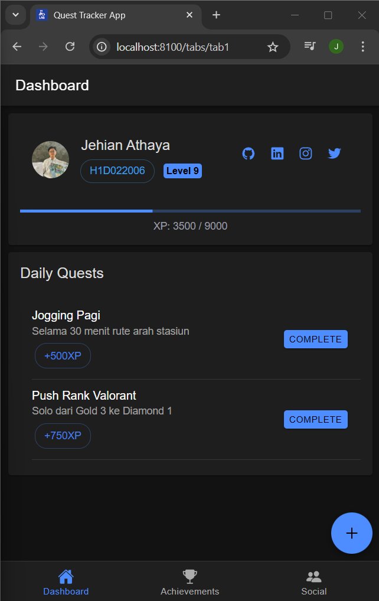
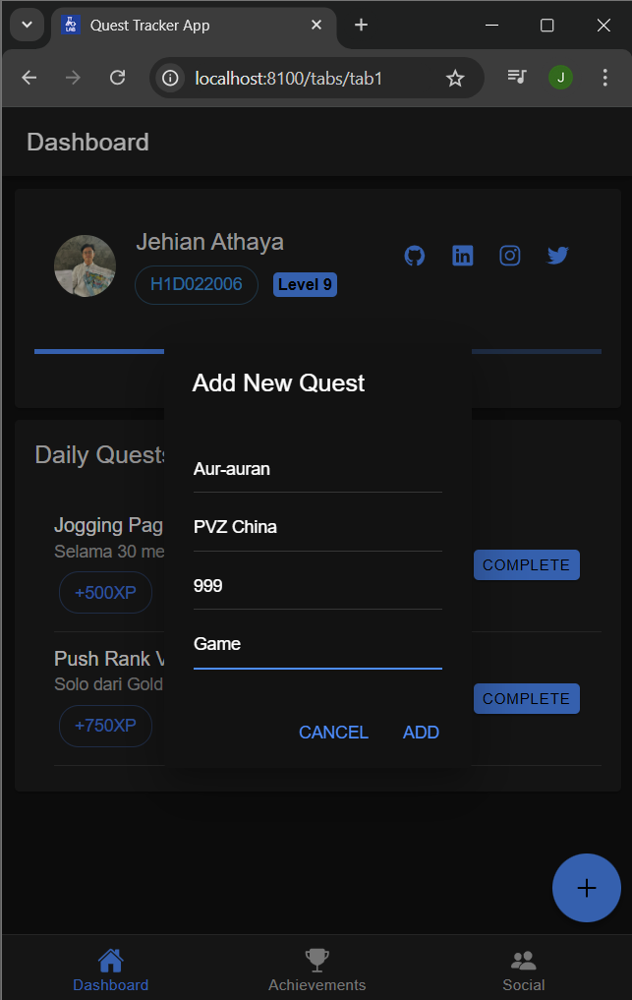
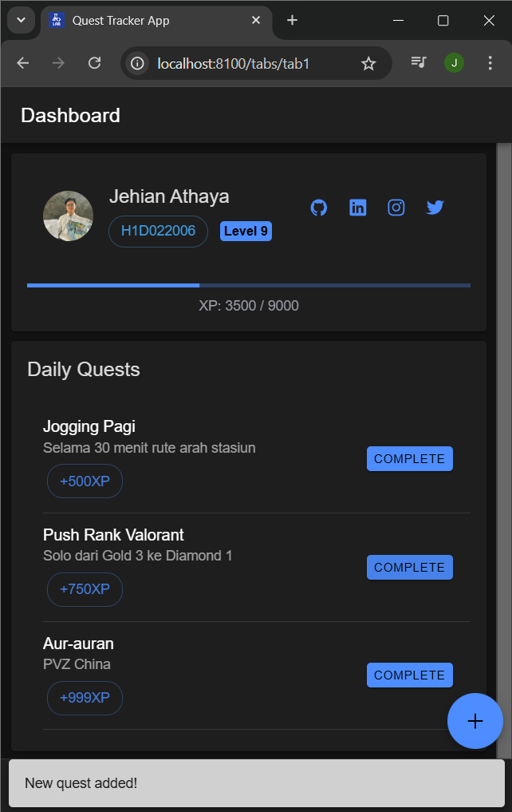
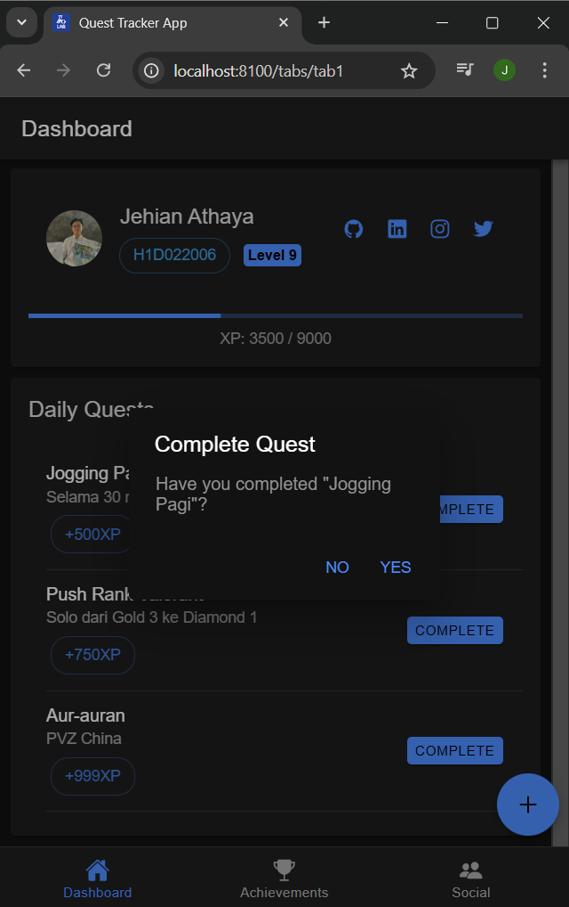
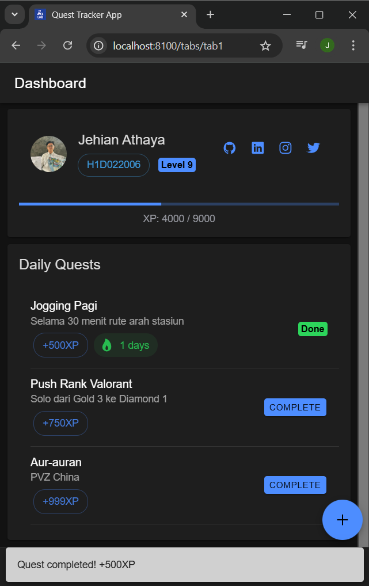
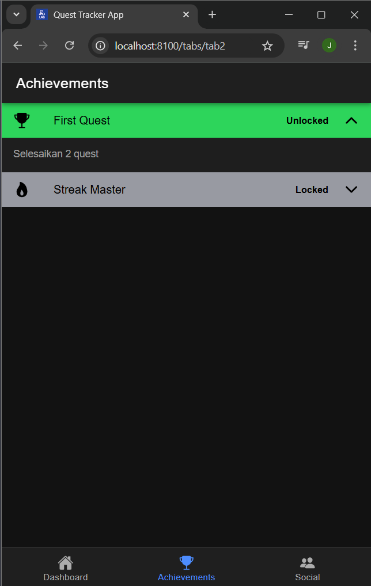
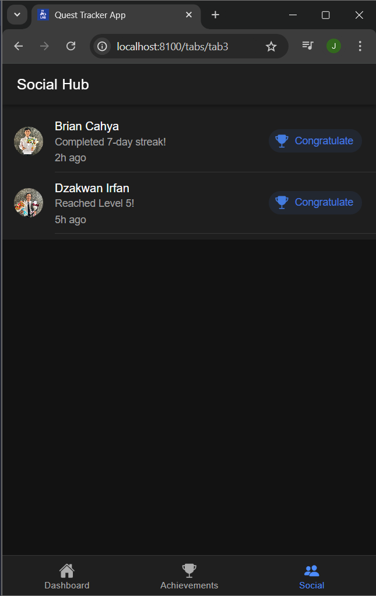
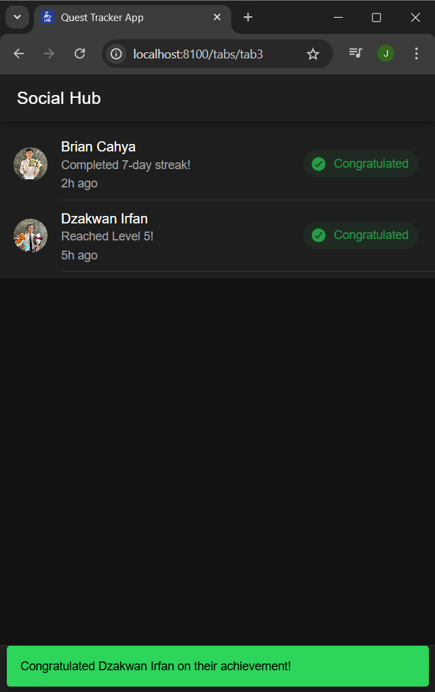

# Tugas 6 - Pertemuan 7

Dibuat oleh:
- Nama: Jehian Athaya
- NIM: H1D022006

## Tentang Aplikasi
Aplikasi ini adalah sistem tracking quest dan achievement yang dibuat menggunakan Ionic Framework dengan Angular. Aplikasi memungkinkan pengguna untuk mengelola quest harian, melacak pencapaian, dan berinteraksi dengan pengguna lain melalui fitur sosial.

## Cara Menambahkan Komponen di Ionic

### 1. Membuat Komponen Baru
```bash
ionic generate component nama-komponen
```
Contoh:
```bash
ionic generate component components/quest-card
```

### 2. Menggunakan Komponen Ionic
Untuk menggunakan komponen bawaan Ionic, tambahkan tag komponen ke file HTML:

1. Card:
```html
<ion-card>
  <ion-card-header>
    <ion-card-title>Judul Card</ion-card-title>
  </ion-card-header>
  <ion-card-content>
    Isi konten card
  </ion-card-content>
</ion-card>
```

2. List:
```html
<ion-list>
  <ion-item>
    <ion-label>Item List</ion-label>
  </ion-item>
</ion-list>
```

3. Button:
```html
<ion-button>
  Tombol
</ion-button>
```

### 3. Styling Komponen
Tambahkan CSS di file `.scss`:
```scss
ion-card {
  margin: 16px;
  
  ion-card-title {
    font-size: 1.2rem;
    font-weight: bold;
  }
}
```

## Pembaruan yang Dilakukan

1. Dashboard (Tab 1):
   - Menambahkan profil hero dengan informasi pribadi
   - Implementasi sistem XP dan level
   - Fitur quest harian dengan sistem streak
   - Tombol untuk menambah quest baru

2. Achievement (Tab 2):
   - Menampilkan daftar achievement yang bisa didapatkan
   - Sistem unlock achievement otomatis
   - Visual feedback untuk achievement yang sudah/belum terbuka

3. Social Hub (Tab 3):
   - Feed aktivitas pengguna lain
   - Fitur congratulate untuk achievements
   - Animasi dan feedback visual

## Screenshot Aplikasi

### Dashboard



- Menampilkan profil pengguna dengan nama Jehian Athaya (H1D022006)
- Progress bar XP dan level
- Daftar quest harian
- Tombol untuk menambah quest baru

### Menambah Quest Baru





- Form untuk menambah quest baru
- Input untuk judul, deskripsi, XP, dan kategori
- Validasi input

### Menyelesaikan Quest





- Konfirmasi penyelesaian quest
- Notifikasi XP yang didapat
- Update progress bar dan level

### Achievement



- Daftar achievement yang tersedia
- Status locked/unlocked
- Deskripsi cara mendapatkan achievement

### Social Hub





- Feed aktivitas pengguna lain
- Fitur congratulate
- Avatar dan timestamp aktivitas
